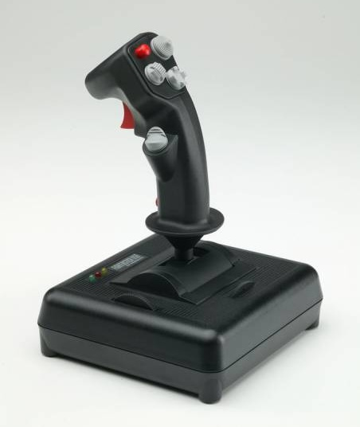

# Using CH Fighterstick on MiSTer (AO486)

This joystick has three analog axis, third one being the throttle wheel which
needs to be mapped to Stick 2 Y-axis. Unfortunately, only mapping Y-axis is
[not supported](https://github.com/MiSTer-devel/Main_MiSTer/issues/723).

To get around this problem, [`input_068e_00f3_v3.map`](input_068e_00f3_v3.map) is a hex edited input map
for the stick with throttle mapped correctly. Copy the file to
`/media/fat/config/inputs` directory.

## AO486 Configuration

```
Joystick type:  2/4 buttons
Joystick mode:  2 sticks
Joystick 1:     Enabled
Joystick 2:     Disabled
```

Type doesn't really matter, since you'll likely want to map a ton of buttons to
keyboard keys anyway.

Copy joystick utilities from the [`UTIL/`](UTIL/) directory to `C:\UTIL`. Most of them
are for diagnostics and hardware calibration.

## X-Wing & TIE Fighter

The [XWJOY.COM](https://github.com/pagej97/xwjoy-redux) utility adds throttle
support for these two games. It translates throttle movement to keyboard key
presses matching speed up/down actions. After calibration, add call to the
utility in `AUTOEXEC.BAT`.

TIE Fighter specifically had a peculiar problem with the joystick; it seemed to
only detect Stick 2 (aka. throttle) and buttons 3 and 4. Only way I could find
to workaround the problem is manually setting the `Joystick mode` to `2
joysticks`, reloading the core and switching back to `2 sticks` after the game
has booted up.

Before mapping joystick buttons to keyboard keys, make sure the game has its
own configuration files for storing mappings across boots. If you're using
[ROMweasel](https://github.com/Koston-0xDEADBEEF/MiSTer-ROMweasel) to download
0MHz DOS collection games, this is done automatically (see `<setname>` tag).

## Misc

For diagnostics, Linux tools `lsusb(8)`, `jscal(1)` and `jstest(1)` can be used
in MiSTer shell. To monitor input events in realtime, MiSTer menu process needs
to be terminated.

MiSTer also provides `hexdump(1)` and `hexedit(1)` tools, if you want to
inspect and/or modify input maps directly.
