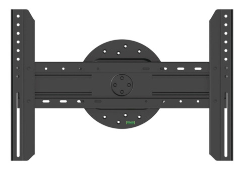

# Using MiSTer on LG G2 65" OLED TV

This TV is a bit quirky, but capable of displaying 1920x1440 resolution with
low latency, VRR enabled. I have not yet come across a core that didn't sync to
the TV with `vsync_adjust=2`.

## Physical Setup

Since a significant number of games I want to play are TATE, being able to
rotate the display 90 degrees is very desirable. Luckily, a cheap but perfectly
serviceable solution exists. It's sold under a whole bunch of different brand
names, and goes for around 50-70€.

In addition to the mount itself, longer cables are also required along with
cable ties and spiral wrap or equivalent. All cables from the TV need to be
firmly secured to ensure there won't be any tugging of connectors when rotating
the TV.

## Configuration

Included is my full [MiSTer.ini](MiSTer.ini) configuration file.

### G2 vs. 4:3 aspect ratio

The G2 has a big problem with 4:3 aspect ratio. When 1920x1440 signal is displayed
in 4:3, the TV adds significant amount of lag. But, forcing the same signal to
16:9 in TV settings removes the lag.

Taking advantage of the forced widescreen mode, MiSTer cores are configured to
squeeze out a custom 1:1 aspect ratio, which is then stretched to 16:9 by the
TV, ultimately resulting in the desired 4:3 ratio.

Stupid solution to a stupid problem.

### G2 vs. AO486

The AO486 core is special; most PC video signals default to 70Hz refresh rate,
and the default 1920x1440 resolution at 70Hz exceeds maximum pixel clock MiSTer
is capable of, so it cannot be used.

A lower resolution of 1920x1200 fits within pixel clock limits, and scales well
too since most PC games run in 320x200. The TV on the other hand has another
bizarre problem with it - most of the time, this resolution is identified as
1920x1201, resulting in a bright vertical garbage line at the bottom of the TV.

Another stupid solution to another stupid problem - configured MiSTer output
resolution to 1920x1199, and the end result is correct.

### G2 Settings

* Picture forced to 16:9
* Game Optimiser mode with VRR enabled
* All dynamic functions OFF
* Pixel brightness and contrast at 100
* Black Stabiliser: 14
* White Stabiliser: 8
* Black Level: 52
* Game Sharpness: 50

Intention of this setup is to produce a stable and predictable image and
letting MiSTer handle video filtering. Black and white stabilisers and black
level are the only settings on TV which are actually used to fine-tune the
picture.

A viable alternative is enabling dynamic contrast and calling it a day.

### MiSTer Settings

Settings in [MiSTer.ini](MiSTer.ini) should be a good starting point for
modeling a consumer grade Trinitron CRT. From there, adjust sharpness and
scanline intensity and brightness. Desired settings are up to personal
preference, but also depend a lot on viewing distance.

There's no default for gamma, but most games benefit from it. Rule of thumb,
older games want more gamma. Start with pure gamma at 110 or 113, if it doesn't
cut it, test poly gamma values until picture is good.
